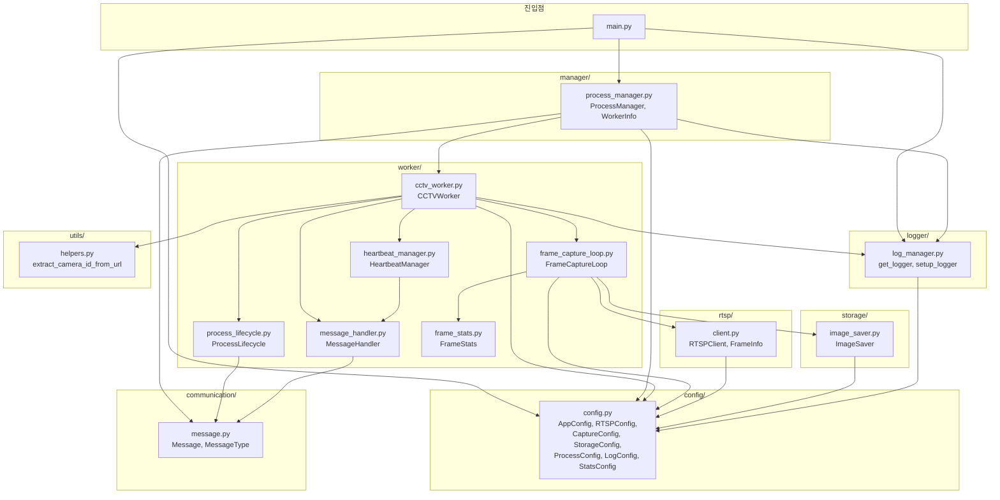
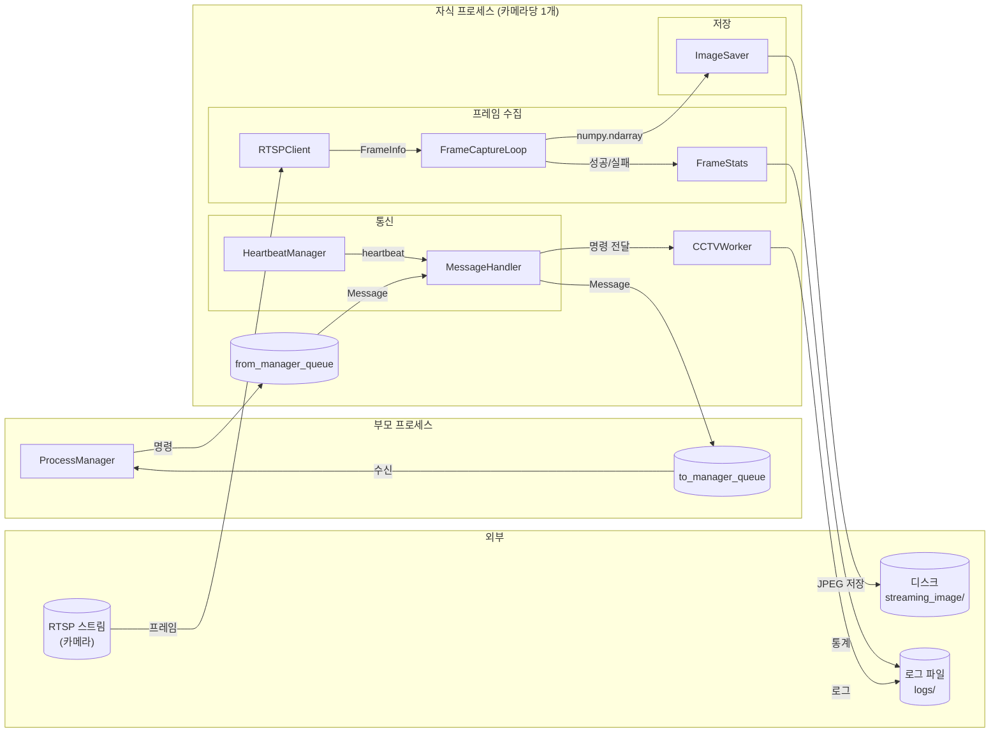
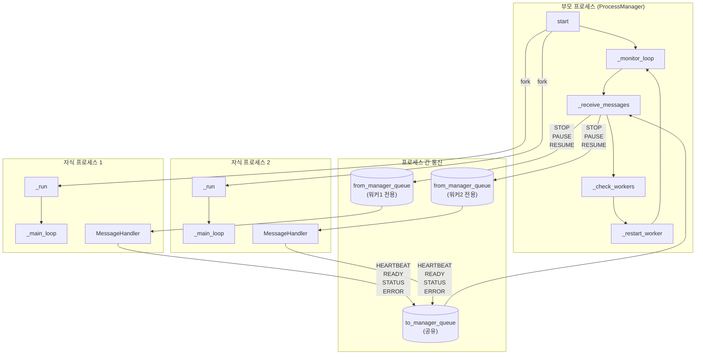
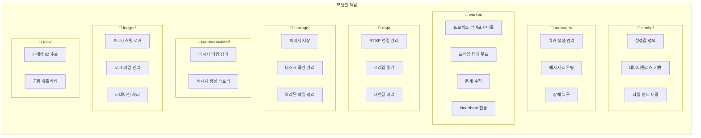
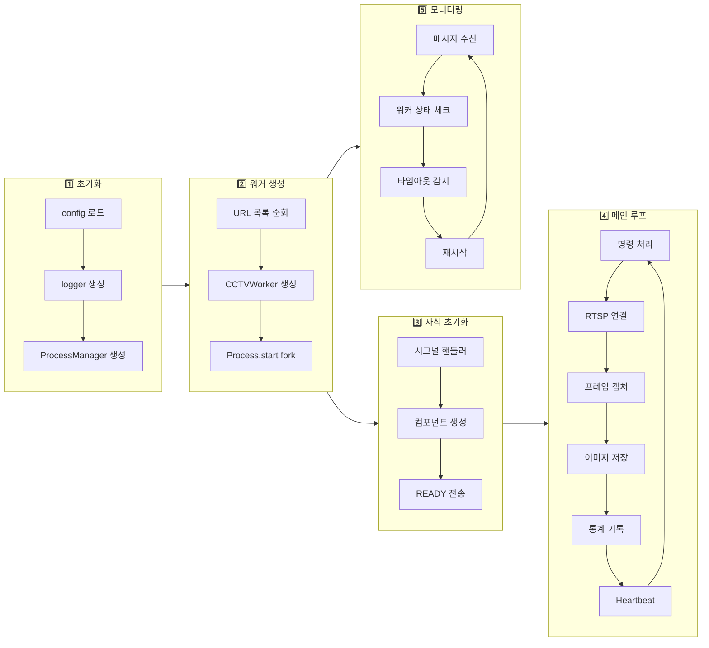

# 모듈 단위 전체 흐름 플로우차트

## 모듈 구조 및 의존성



## 데이터 흐름도



## 프로세스 간 통신 흐름



## 모듈별 책임



## 실행 순서 타임라인



## 파일 구조

```
cctv_util/
├── main.py                    # 진입점
├── config.py                  # 설정 정의
│
├── manager/                   # 부모 프로세스
│   ├── __init__.py
│   └── process_manager.py     # ProcessManager
│
├── worker/                    # 자식 프로세스
│   ├── __init__.py
│   ├── cctv_worker.py         # 메인 조율자
│   ├── process_lifecycle.py   # 프로세스 관리
│   ├── message_handler.py     # 메시지 송수신
│   ├── frame_capture_loop.py  # 프레임 캡처
│   ├── heartbeat_manager.py   # Heartbeat
│   └── frame_stats.py         # 통계
│
├── rtsp/                      # RTSP 연결
│   ├── __init__.py
│   └── client.py              # RTSPClient
│
├── storage/                   # 저장소
│   ├── __init__.py
│   └── image_saver.py         # ImageSaver
│
├── communication/             # 통신
│   ├── __init__.py
│   └── message.py             # Message, MessageType
│
├── logger/                    # 로깅
│   ├── __init__.py
│   └── log_manager.py         # 로거 설정
│
├── utils/                     # 유틸리티
│   ├── __init__.py
│   └── helpers.py             # 헬퍼 함수
│
├── streaming_image/           # 저장된 이미지
│   └── {camera_id}/           # 카메라별 폴더
│
└── logs/                      # 로그 파일
    └── {camera_id}/           # 카메라별 로그
```

## 모듈 간 호출 관계 요약

| 호출하는 모듈 | 호출되는 모듈                                         | 목적           |
| ------------- | ----------------------------------------------------- | -------------- |
| `main.py`     | `config`, `manager`, `logger`                         | 시스템 시작    |
| `manager`     | `worker`, `communication`, `config`                   | 워커 관리      |
| `worker`      | `rtsp`, `storage`, `communication`, `logger`, `utils` | 프레임 수집    |
| `rtsp`        | `config`                                              | RTSP 연결 설정 |
| `storage`     | `config`                                              | 저장 설정      |
| `logger`      | `config`                                              | 로그 설정      |
