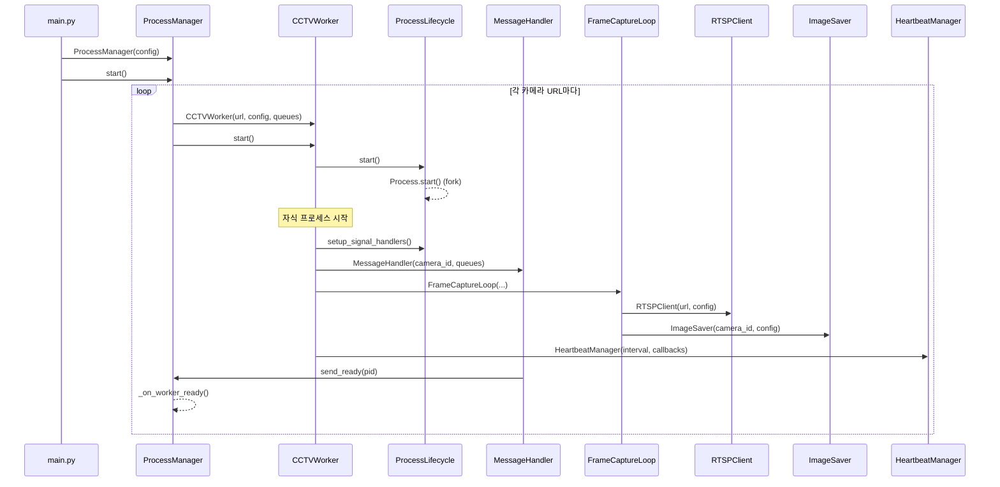

# 시스템 시작 시퀀스 다이어그램

## 설명

1. `main.py`에서 `ProcessManager`를 생성하고 `start()` 호출
2. 각 카메라 URL에 대해 `CCTVWorker` 생성
3. 워커가 자식 프로세스로 fork되어 독립 실행
4. 자식 프로세스에서 필요한 컴포넌트들 초기화
5. 준비 완료 후 부모에게 `READY` 메시지 전송
