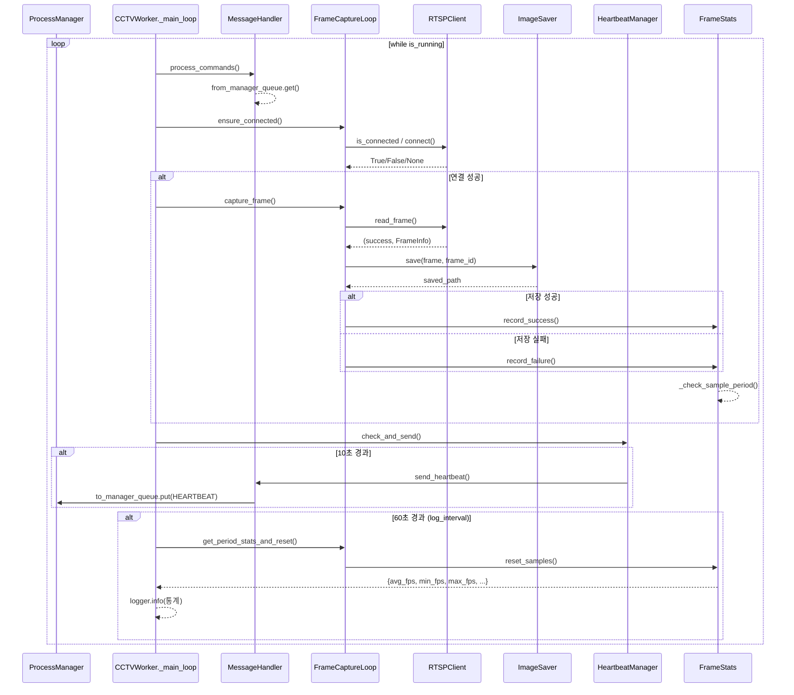

# 메인 루프 시퀀스 다이어그램

## 설명

### 메인 루프 단계

1. **명령 처리**: 부모로부터 받은 명령(STOP, PAUSE 등) 확인
2. **연결 확인**: RTSP 스트림 연결 상태 확인 및 재연결
3. **프레임 캡처**: 프레임 읽기 → 이미지 저장 → 통계 기록
4. **Heartbeat**: 10초마다 부모에게 생존 신호 전송
5. **통계 로깅**: 60초마다 수집된 샘플의 평균 통계 출력
