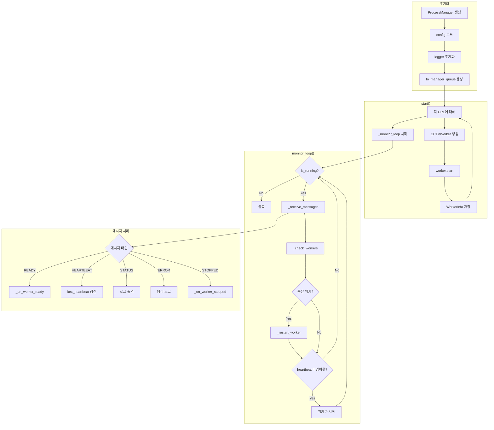

# 부모 프로세스 (ProcessManager) 플로우차트

## 설명

### 주요 책임

| 함수                  | 역할                                      |
| --------------------- | ----------------------------------------- |
| `start()`             | 모든 워커 프로세스 생성 및 시작           |
| `stop()`              | 모든 워커에 종료 명령 전송                |
| `_monitor_loop()`     | 워커 상태 모니터링 루프                   |
| `_receive_messages()` | 워커로부터 메시지 수신 처리               |
| `_check_workers()`    | 워커 생존 여부 및 heartbeat 타임아웃 확인 |
| `_restart_worker()`   | 죽은 워커 재시작                          |

### 워커 관리

- **WorkerInfo**: 각 워커의 상태 정보 (worker 객체, 큐, 마지막 heartbeat 시간
  등)
- **자동 재시작**: 워커가 죽거나 heartbeat 타임아웃 시 자동 재시작
