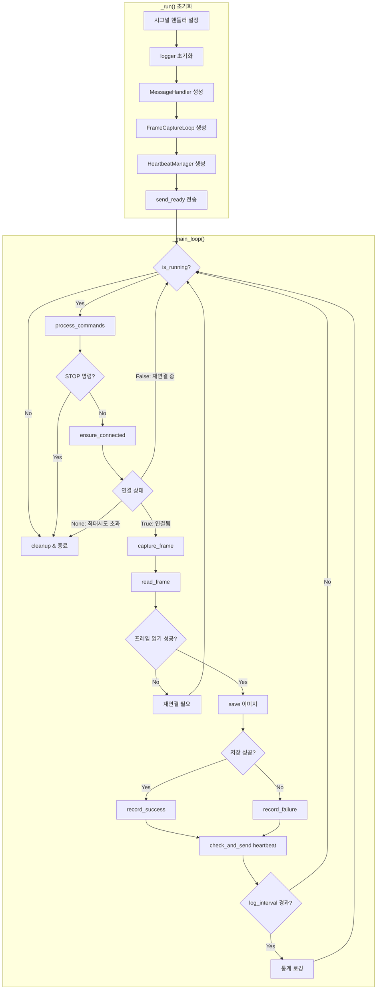

# 자식 프로세스 (CCTVWorker) 플로우차트

## 설명

### 워커 구성 요소

| 컴포넌트         | 파일                    | 역할                           |
| ---------------- | ----------------------- | ------------------------------ |
| ProcessLifecycle | `process_lifecycle.py`  | 프로세스 시작/중지/시그널 처리 |
| MessageHandler   | `message_handler.py`    | 부모-자식 간 메시지 송수신     |
| FrameCaptureLoop | `frame_capture_loop.py` | RTSP 연결 및 프레임 캡처       |
| HeartbeatManager | `heartbeat_manager.py`  | 주기적 heartbeat 전송          |
| FrameStats       | `frame_stats.py`        | 프레임 수집 통계 관리          |

### 연결 상태 반환값

| 반환값  | 의미           | 동작             |
| ------- | -------------- | ---------------- |
| `True`  | 연결됨         | 프레임 캡처 진행 |
| `False` | 재연결 중      | 대기 후 재시도   |
| `None`  | 최대 시도 초과 | 프로세스 종료    |
