# 통계 수집 (FrameStats) 플로우차트

```mermaid
flowchart TB
    subgraph Sampling["샘플링 (매 프레임)"]
        A[record_success/failure] --> B[current_sample_frames++]
        B --> C[_check_sample_period]
        C --> D{sampling_period 경과?}
        D -->|No| END1[대기]
        D -->|Yes| E[현재 FPS 계산]
        E --> F[fps_samples에 추가]
        F --> G[current_sample 초기화]
    end
    
    subgraph Logging["통계 출력 (log_interval마다)"]
        H[reset_samples 호출] --> I[남은 샘플 기록]
        I --> J[평균/최소/최대 FPS 계산]
        J --> K[저장 성공률 계산]
        K --> L[통계 dict 반환]
        L --> M[샘플 리스트 초기화]
    end
    
    subgraph Example["예시: sampling=1초, log_interval=60초"]
        X1[1초: FPS 10.2 기록] --> X2[2초: FPS 9.8 기록]
        X2 --> X3[...]
        X3 --> X4[60초: 60개 샘플 수집]
        X4 --> X5[평균 FPS 10.05 출력]
        X5 --> X6[샘플 초기화]
        X6 --> X1
    end
```



## 설명

### 설정값

| 설정              | 기본값 | 설명                     |
| ----------------- | ------ | ------------------------ |
| `sampling_period` | 1초    | FPS 샘플링 주기          |
| `log_interval`    | 60초   | 통계 출력 및 초기화 주기 |

### 통계 수집 흐름

1. **프레임마다**: `record_success()` 또는 `record_failure()` 호출
2. **sampling_period마다**: 해당 기간의 FPS 계산하여 `fps_samples` 리스트에 추가
3. **log_interval마다**: 모인 샘플들의 평균/최소/최대 계산 후 로깅

### 출력 예시

```
[60초 통계] 샘플 수: 60개, 수집: 600개, 저장: 598개, 실패: 2개,
           평균 FPS: 10.02, 최소 FPS: 9.85, 최대 FPS: 10.15, 저장 성공률: 99.7%
```

### 통계 항목

| 항목                | 설명                                                |
| ------------------- | --------------------------------------------------- |
| `sample_count`      | 수집된 샘플 개수 (= log_interval / sampling_period) |
| `frames_collected`  | 총 수집된 프레임 수                                 |
| `frames_saved`      | 저장 성공한 프레임 수                               |
| `frames_failed`     | 저장 실패한 프레임 수                               |
| `avg_fps`           | 평균 FPS                                            |
| `min_fps`           | 최소 FPS                                            |
| `max_fps`           | 최대 FPS                                            |
| `save_success_rate` | 저장 성공률 (%)                                     |
