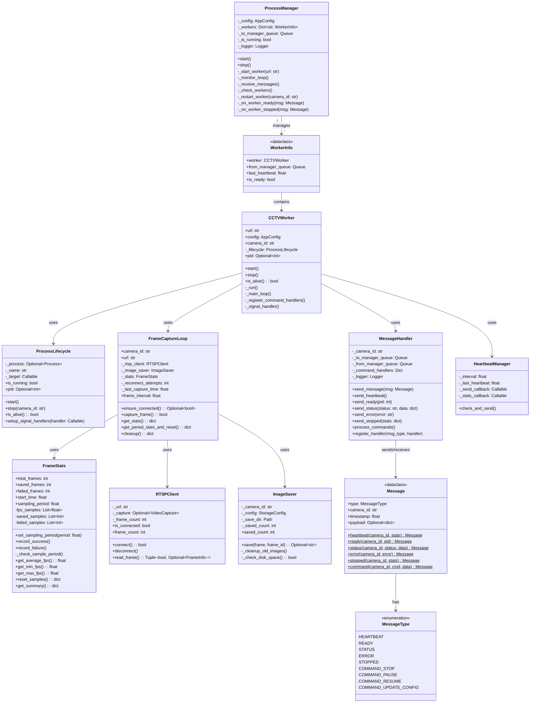

# 클래스 구조 다이어그램

## 클래스 관계 설명

### 부모 프로세스 (ProcessManager)

| 클래스           | 역할                                |
| ---------------- | ----------------------------------- |
| `ProcessManager` | 전체 워커 프로세스 관리 및 모니터링 |
| `WorkerInfo`     | 개별 워커의 상태 정보 저장          |

### 자식 프로세스 (CCTVWorker)

| 클래스             | 역할                               |
| ------------------ | ---------------------------------- |
| `CCTVWorker`       | 워커 프로세스 메인 조율자 (Facade) |
| `ProcessLifecycle` | 프로세스 생명주기 관리             |
| `MessageHandler`   | IPC 메시지 송수신                  |
| `FrameCaptureLoop` | RTSP 연결 및 프레임 캡처           |
| `HeartbeatManager` | 주기적 heartbeat 전송              |
| `FrameStats`       | 프레임 수집 통계                   |

### 외부 연동

| 클래스       | 역할                            |
| ------------ | ------------------------------- |
| `RTSPClient` | OpenCV 기반 RTSP 스트림 연결    |
| `ImageSaver` | 이미지 파일 저장 및 디스크 관리 |

### 통신

| 클래스        | 역할                   |
| ------------- | ---------------------- |
| `Message`     | IPC 메시지 데이터 구조 |
| `MessageType` | 메시지 타입 열거형     |
